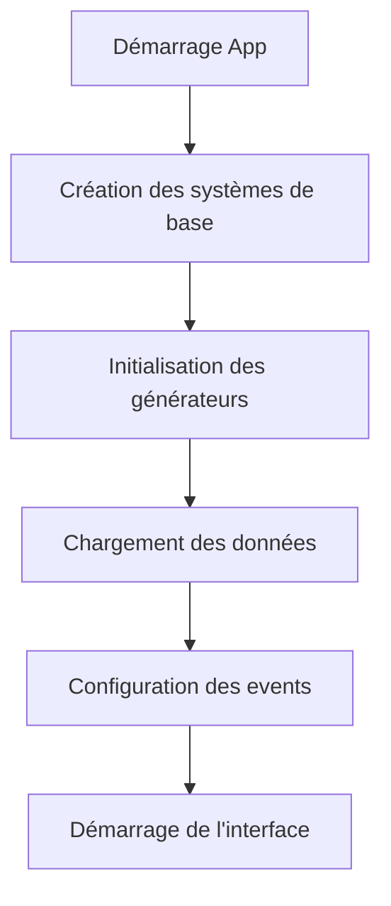

# Point d'étape - Card Clicker Game

## 🎯 Problèmes Résolus

### Système de Générateurs
- ✅ Initialisation systématique des générateurs de base
- ✅ Conservation des générateurs lors du chargement des sauvegardes
- ✅ Mise à jour correcte des niveaux et productions
- ✅ Affichage de tous les générateurs dans l'interface

### Architecture
- ✅ Simplification du flux d'initialisation
- ✅ Meilleure séparation des responsabilités
- ✅ Gestion correcte des événements
- ✅ Sauvegarde/chargement fonctionnels

## 🏗️ Architecture Actuelle

### Core Systems
1. **CurrencySystem**
   - Gestion de la monnaie
   - Multiplicateurs et bonus

2. **AutoClickManager**
   - Gestion des générateurs
   - 4 niveaux de générateurs (Basic → Elite)
   - Production automatique
   - Sauvegarde des niveaux

3. **SaveManager**
   - Sauvegarde automatique
   - Gains hors-ligne
   - Persistance des données

### Flux d'Initialisation


## 📊 Générateurs

| ID      | Production | Coût Initial | Description |
|---------|------------|--------------|-------------|
| Basic   | 1/sec      | 10          | Générateur basique |
| Advanced| 8/sec      | 100         | Générateur avancé |
| Pro     | 47/sec     | 1,000       | Générateur pro |
| Elite   | 260/sec    | 10,000      | Générateur élite |

## 💾 Structure des Données

### Format de Sauvegarde
```javascript
{
    generators: [
        {
            id: string,
            level: number,
            baseProduction: number,
            baseCost: number,
            description: string,
            lastPurchaseCost: number
        }
    ],
    lastUpdate: timestamp,
    totalProduction: number
}
```

## 🚀 Prochaines Étapes

### Priorité Haute
- [ ] Implémentation du système de cartes
- [ ] Système de boosters
- [ ] Améliorations visuelles des générateurs

### Améliorations Futures
- [ ] Bonus temporaires
- [ ] Achievements
- [ ] Statistiques détaillées
- [ ] Interface de collection

## 🐛 Points de Vigilance
1. Ordre d'initialisation des systèmes
2. Gestion des événements de sauvegarde
3. Performance avec beaucoup de générateurs
4. Calcul des gains hors-ligne

## 📝 Documentation
- [Code source sur GitHub](#)
- [Guide de contribution](#)
- [Documentation API](#)

## 🔧 Maintenance
- Tests unitaires à écrire
- Code à documenter
- Optimisations possibles
- Refactoring à prévoir

---
*Note: Cette version est stable et fonctionnelle. Focus maintenant sur l'ajout de nouvelles fonctionnalités.*
